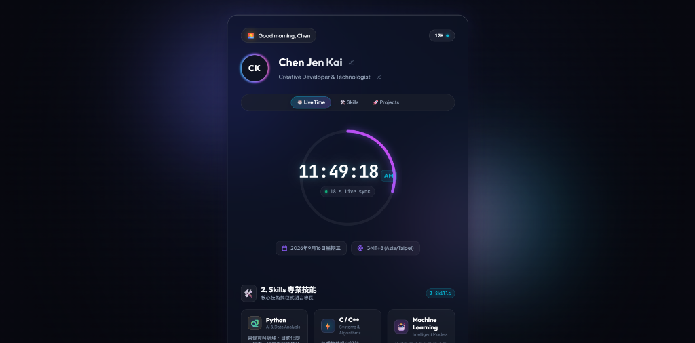

# 🌌 Personal Space & Live Clock

> A sleek, modern personal dashboard featuring real-time clock synchronization, a dynamic SVG seconds progress ring, time-of-day greetings, and Deep Aurora Glassmorphism aesthetics.

[](https://developer.mozilla.org/en-US/docs/Web/HTML)
[](https://developer.mozilla.org/en-US/docs/Web/CSS)
[](https://developer.mozilla.org/en-US/docs/Web/JavaScript)
[](https://czk001167-hash.github.io/0916/)
[](LICENSE)

🔗 **Live Demo**: [https://czk001167-hash.github.io/0916/](https://czk001167-hash.github.io/0916/)

[](https://czk001167-hash.github.io/0916/)

---

## ✨ Features

- 🕒 **High-Precision Live Clock**:
  - Millisecond-synced digital time display (`HH:MM:SS`) with tabular digits (`JetBrains Mono`) to eliminate visual jitter.
  - Interactive **12-Hour / 24-Hour format toggle** with smooth indicator state.
  - Live localized date and automatic timezone detection (e.g., `GMT+8 (Asia/Shanghai)`).
- 🪐 **Smooth Circular SVG Seconds Ring**:
  - Custom SVG progress ring tracking 0–60 seconds in real-time with radiant gradient stroke and drop-shadow glow.
- 🌅 **Time-Aware Dynamic Greeting**:
  - Automatically greets visitors based on the current hour:
    - `05:00 - 11:59` ➔ 🌅 *Good morning*
    - `12:00 - 16:59` ➔ ☀️ *Good afternoon*
    - `17:00 - 21:59` ➔ 🌆 *Good evening*
    - `22:00 - 04:59` ➔ 🌙 *Good night*
- ✏️ **Interactive In-Place Customization**:
  - Click on your name or role (or the pencil icons) to edit text inline.
  - Changes instantly update the avatar initials and persist across page reloads via `localStorage`.
- 🎨 **Deep Aurora Glassmorphism**:
  - Multi-layered floating radial gradient orbs (indigo, cyan, pink) with smooth background animation.
  - Frosted glass container (`backdrop-filter: blur(28px)`) with luminous border accents.
  - Subtle interactive mouse parallax lighting effect.
- 📱 **Fully Responsive**:
  - Optimized for desktops, tablets, and mobile screens.

---

## 🛠️ 2. Skills (專業技能)

- 🐍 **Python**: 資料處理、模型訓練、自動化腳本開發（NumPy, Pandas, Scikit-Learn）。
- ⚡ **C / C++**: 物件導向程式設計 (OOP)、標準模板庫 (STL)、資料結構與演算法、底層記憶體管理。
- 🤖 **Machine Learning**: 機器學習演算法、特徵工程、深度學習架構與 AI 應用。

---

## 🚀 3. Projects (作品與專案)

### 🌟 Personal Space & Live Clock Dashboard
- **專案名稱 (Project Name)**: Personal Space & Live Clock Dashboard
- **專案簡介 (Project Description)**: 以極光玻璃擬態為主題的個人動態資訊首頁，整合高精度毫秒即時時鐘、SVG 秒數動態進度環、時段自適應問候語、12H/24H 雙模式切換與 LocalStorage 資料即時編輯保存。
- **使用技術 (Tech Stack)**: HTML5 (語意化標籤), CSS3 (Glassmorphism & Keyframe 極光動畫), Modern JavaScript (ES6+), SVG 向量繪圖, LocalStorage API, RWD 響應式設計。
- **GitHub 連結 (GitHub Link)**: [https://github.com/czk001167-hash/0916](https://github.com/czk001167-hash/0916)
- **線上預覽 (Live Demo)**: [https://czk001167-hash.github.io/0916/](https://czk001167-hash.github.io/0916/)

---

## 📂 Project Structure

```text
├── index.html        # Semantic HTML5 markup, glass card layout, and SVG progress ring
├── style.css         # Design tokens, Aurora animations, glassmorphic styling, and responsiveness
├── app.js            # Clock synchronization loop, greeting engine, format toggle, and persistence
├── demo-preview.png  # Live demo interface screenshot
└── README.md         # Project documentation
```

---

## 🚀 Quick Start

### 1. Clone the repository
```bash
git clone https://github.com/czk001167-hash/0916.git
cd 0916
```

### 2. Run locally
No build step or dependencies required! Simply open `index.html` in your favorite web browser:

- **Windows (PowerShell)**:
  ```powershell
  start index.html
  ```
- **macOS**:
  ```bash
  open index.html
  ```
- **Linux**:
  ```bash
  xdg-open index.html
  ```

Or use VS Code's **Live Server** extension.

---

## ⚙️ Configuration & Customization

### Change Default Name & Title
In [`app.js`](file:///c:/Users/user/Desktop/0916/app.js), adjust `DEFAULT_VALUES`:
```javascript
const DEFAULT_VALUES = {
  NAME: 'Your Name',
  TITLE: 'Your Role / Title',
  FORMAT: '12H' // or '24H'
};
```
*(Note: You can also edit it directly in the browser by clicking the edit icon!)*

### Customize Color Palette
In [`style.css`](file:///c:/Users/user/Desktop/0916/style.css), customize the CSS variables under `:root`:
```css
:root {
  --bg-base: #07080f;
  --aurora-cyan: #06b6d4;
  --aurora-purple: #8b5cf6;
  --aurora-pink: #ec4899;
}
```

---

## 🌐 Deploy to GitHub Pages

You can easily host this page for free with GitHub Pages:

1. Push this repository to GitHub.
2. Go to repository **Settings** ➔ **Pages**.
3. Under **Branch**, select `main` and `/ (root)`.
4. Click **Save** — your personal page will be live in seconds!

---

## 📄 License

This project is open-source under the [MIT License](LICENSE).
